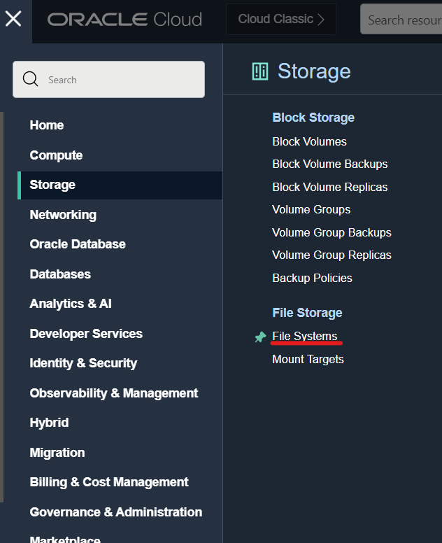
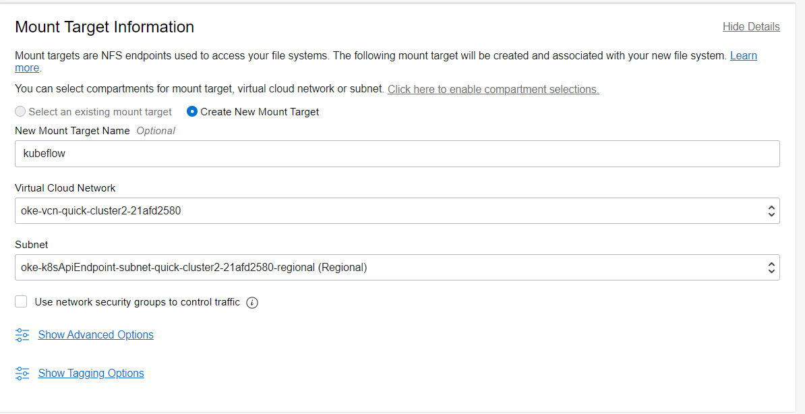

# Task 2 -  NFS StorageClass

Kubeflow recognizes default StorageClass
Follow the steps to add FileStorage service (NFS) as StorageClass.

1. Create File Storage

  In the Console, open the navigation menu and click Storage. Under File Storage click File Systems.
  

  Click Create File System
  

  Edit export information
  

  Edit Mount target information
  Use the worker node subnet.
  

  To get the mount point IP Address.
  Click on the Mount Target to get the IP Address of the mount point. To get Linux Mount commands on the moun and export path.
  

  2. Install NFS subdir external provisioner

  Using the path and IP collected you can deploy NFS helm chart.
  
    helm repo add nfs-subdir-external-provisioner https://kubernetes-sigs.github.io/nfs-subdir-external-provisioner/
    helm install nfs-subdir-external-provisioner nfs-subdir-external-provisioner/nfs-subdir-external-provisioner \
    --set nfs.server=10.0.0.7 \
    --set nfs.path=/kubeflow

  Documentation
  https://kubernetes.io/docs/concepts/storage/storage-classes/#nfs
