# Task 6 - Run Kubeflow pipelines

You can login to Kubeflow using the $LBIP.nip.io (IP of the Ingress or the URL you defined).

By default the first user is **user@examples.com**

> password defined in Task 2.3

The user user@examples.com corresponds to the profil kubeflow-user-example-com.

Once connected to Kubeflow dashboard you can run pipelines and notebook.

## Demo 1 - Iterative model training

To run your first pipeline we run the demo pipelines **[Demo] XGBoost - Iterative model training**.

   1. Create an experiment

  From the Dashboard choose click on [Demo] XGBoost - Iterative model training.

  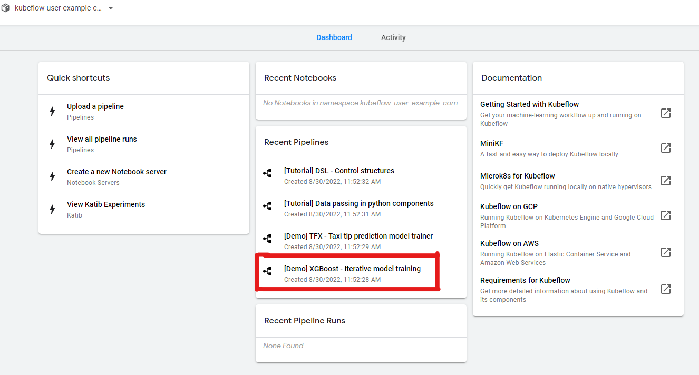

- Create a new experiment
  
  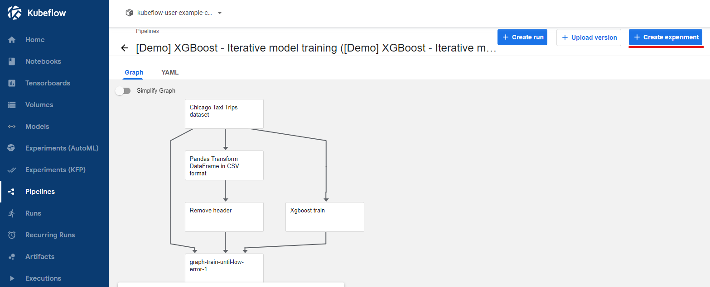

  - Name the Experiment **Default**
  - Click Next

  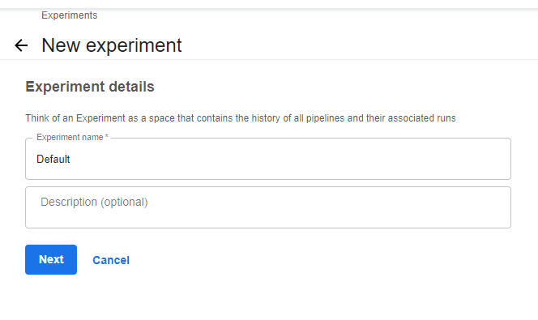

  - Click Start
  
<!-- - Choose a pipeline [Demo] XGBoost - Iterative model training.
- Choose a Run name: Demo1 and click Start

  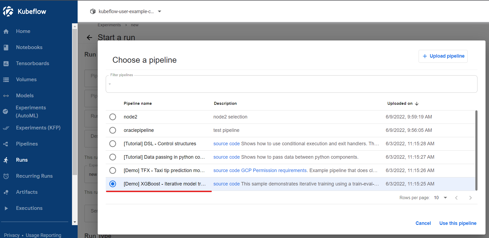 -->

  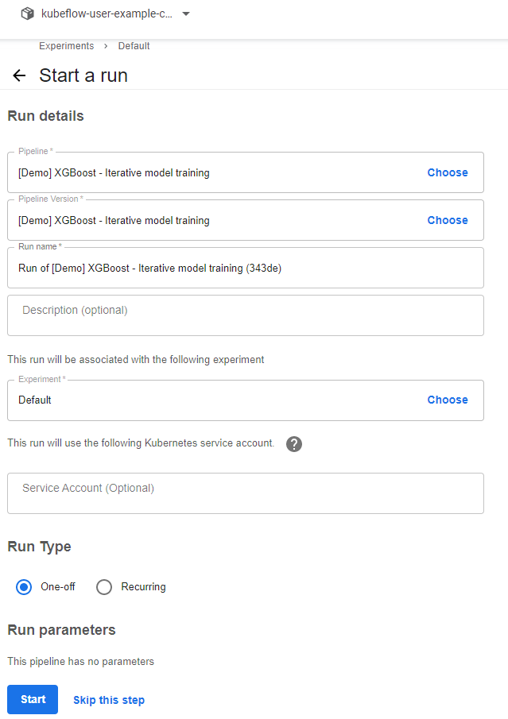

  Click on the run to get the details

  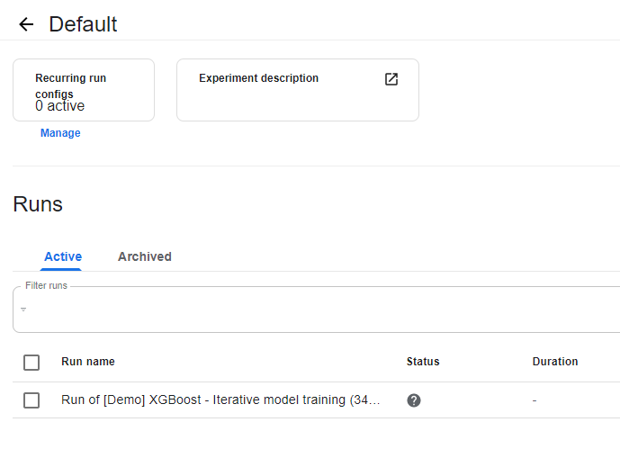

  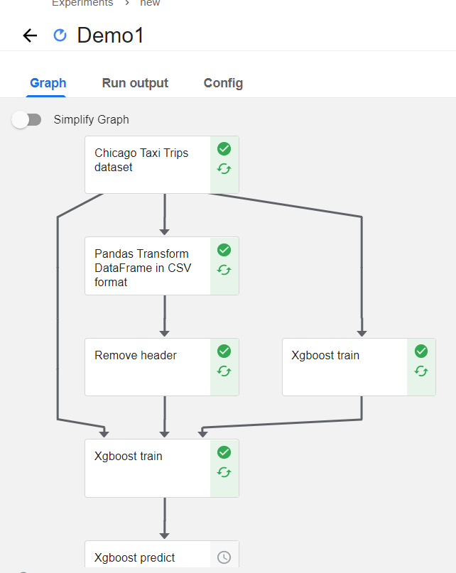

  The run lasts 1-2m  

  **Congratulations**  Kubeflow is operational and model ran successfully.

## Demo 2 - Demo Node selector

 <!-- 1. Download [demo2-nodeselector.yaml](demo2-nodeselector.yaml) file Workflow -->
1. Download <a href="demo2-nodeselector.yaml" download>demo2-nodeselector.yaml</a> file.

2. Create a new pipeline

  Click in Pipelines menu, upload pipeline.
  

3. Upload Pipeline

      - Provide Pipeline Name: Demo2
      - Provide Description: Node Selector
      - Upload file demo2-nodeselector.yaml
      - Click create

4. Create run to execute Demo2 Pipeline

   The pipeline is a Workflow example.

      - We provide an input message
      - First container read the msg and write it down to pass to second container
      - Second container only execute on a Worker node with the label pool2 will read the msg and print it.
      - Click on Create run to execute Demo2 Pipeline.

   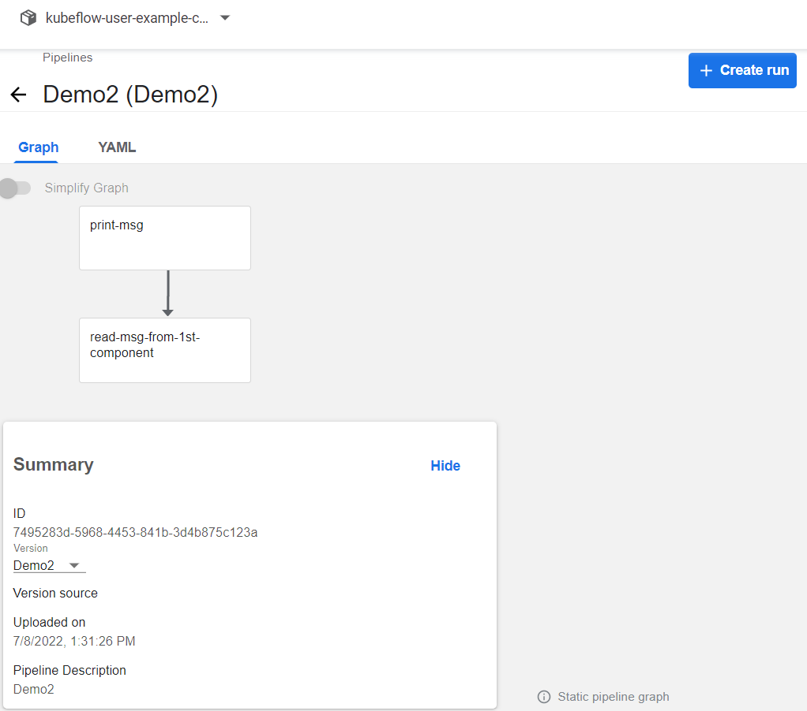

 5. Provide run details

       - Select Default experiment
       - Provide parameter send_msg **Hello_World**
       - Click start
  
  

 6. Click on Run of Demo2

   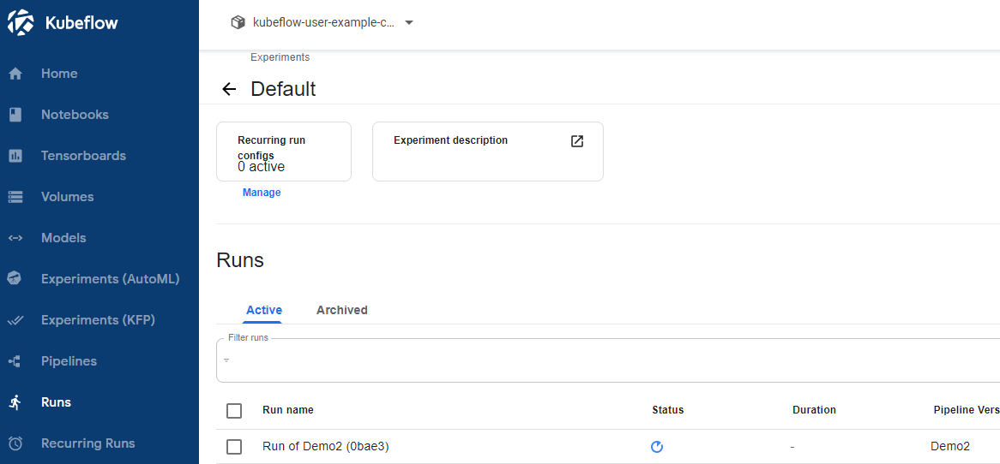

 7. Click on print-msg

     - Pipeline is in a pending state because no nodes are available to execute it.
     - Label a node with the label name=pool2.

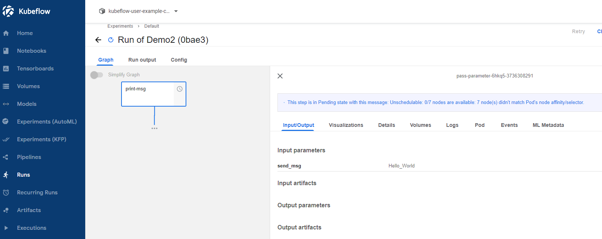

 8. Label a node

 This step simulates the usage of a different node pool.
 You can label your nodes to group them by affinity or different use-cases (Shapes, location, CPU/GPU)

 To execute the pipeline we need to label a node.

- Choose a node

        kubectl get nodes
        NAME           STATUS   ROLES   AGE    VERSION
        10.0.107.12    Ready    node    7d2h   v1.21.5

- Label the first node

        kubectl label node 10.0.107.12 name=pool2
        node/10.0.107.12 labeled

 9. PodInitialzing
  
  

 10. Pipeline successful
  
  A node pool is available to execute the workflow. Pipelin executed successfully.

  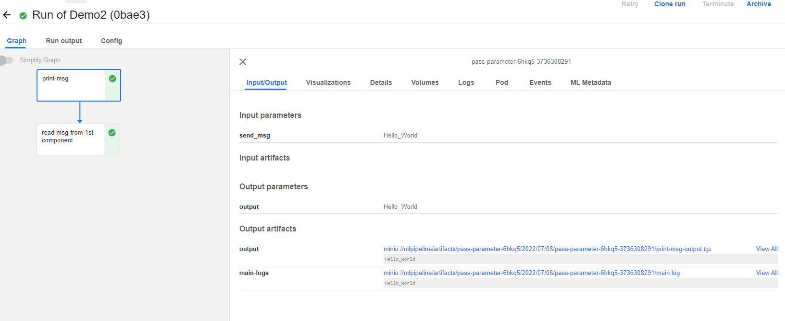

  **Congratulations** the pipeline succeed to pass a parameter to a container to another container.

## Demo 3 - Mnist E2E model Notebook

> Be sure to have enough CPU and RAM resources in your Kubernetes cluster to run Mnist-model and Tfjobs pods

The Mnist Kubeflow example (Modified National Institute of Standards and Technology) guides you through the process of taking an example model, modifying it to run better within Kubeflow, and serving the resulting trained model.

This model entify digits from a dataset of handwritten images.

The orginal steps are available on [Github/Kubeflow/examples](https://github.com/kubeflow/examples/tree/master/mnist#vanilla)

1. Create a Notebook

   First let's create the notebook to define our model.
   

        Name: demo3
        Image: j1r0q0g6/notebooks/notebook-servers/jupyter-tensorflow-full:v1.6.0-rc.1
        CPU: 1
        Memory: 2G
  
  A new volume will be create: New volume demo3-volume, Empty, 10Gi

  You can specfiy a different Storage Class (OCI, OCI-BV, NFS-client)
  <!-- Let's choose oci class -->
  
  <!-- 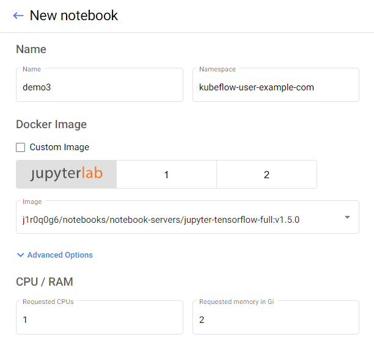
  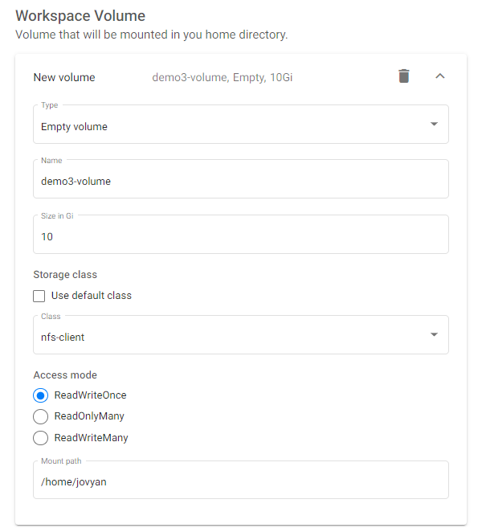
  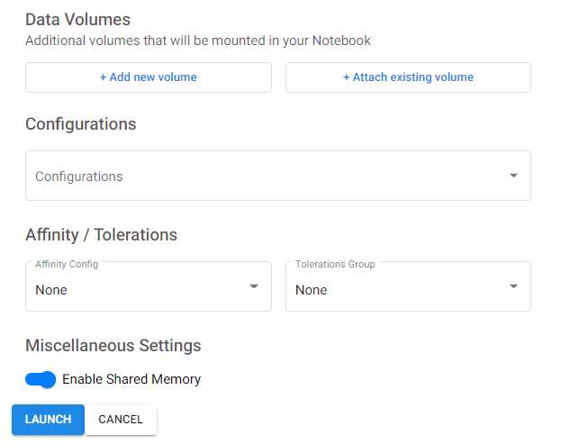 -->

2. Setup docker credentials.

  Kaniko is used by fairing to build the model every time the notebook is run and deploy a fresh model.
  The newly built image is pushed into the DOCKER_REGISTRY and pulled from there by subsequent resources.

  Get your docker registry user and password encoded in base64
  - Create docker config credentials to push images to OCIR registry using the script

  To create the docker config manually

<b>To create the docker config manually click to expand!</b>

  To create the docker config manually
  From the OCI console, in the User details, generate Auth Tokens.

  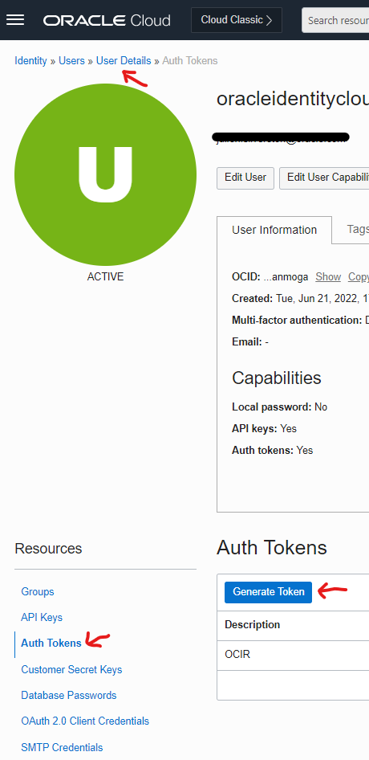

  Your DOCKERUSER is your OCI namespace/username or namespace/oracleidentitycloudservice/username

  > DOCKERUSER=namespace/oracleidentitycloudservice/user@oracle.com
  > DOCKERPASSWORD is the Auth Token

- Create docker secret in your cluster and namespace.

  By default the kubernetes namespace used is **kubeflow-user-example-com**.

  > In Kubeflow namespace and user and synonyms.

    USER=<DOCKERUSER>; PASSWORD=<DOCKERPASSWORD>; echo -n $USER:$PASSWORD | base64 |  xargs echo -n |xargs -0 printf '{
            "auths": {
                "iad.ocir.io": {
                    "auth": "%s"
                }
            },
              "HttpHeaders": {
            "User-Agent": "Docker-Client/18.03.1-ol (linux)"
          }
    }\n' > /tmp/config.json && kubectl create --namespace ${NAMESPACE} configmap docker-config --from-file=/tmp/config.json && rm /tmp/config.json

- Create a Docker registry secret to pull image from your OCIR to OKE.  
  - replace NAMESPACE/usernameOCI by your current namespace and OCI username.
  - replace yourOCIpassword by your OCI Auth token.

        kubectl create secret docker-registry ocirsecret --docker-server=iad.ocir.io --docker-username='NAMESPACE/usernameOCI' --docker-password='yourOCIpassword' --docker-email='username@domain.com' -n kubeflow-user-example-com

3. Create a bucket in OCI Object Storage named "iad.ocir.io-mnist".

4. Create OCIR repository to host Mnist images.
<!-- 5. Create Rolebinding

       NAMESPACE=kubeflow-user-example-com
       kubectl create --namespace=kubeflow rolebinding --clusterrole=kubeflow-view --serviceaccount=${NAMESPACE}:default-editor ${NAMESPACE}-minio-view -->

5. Connect to the new Notebook created. Launch a terminal in Jupyter and clone the kubeflow/examples repoClone Kubeflow example in the Notebook

  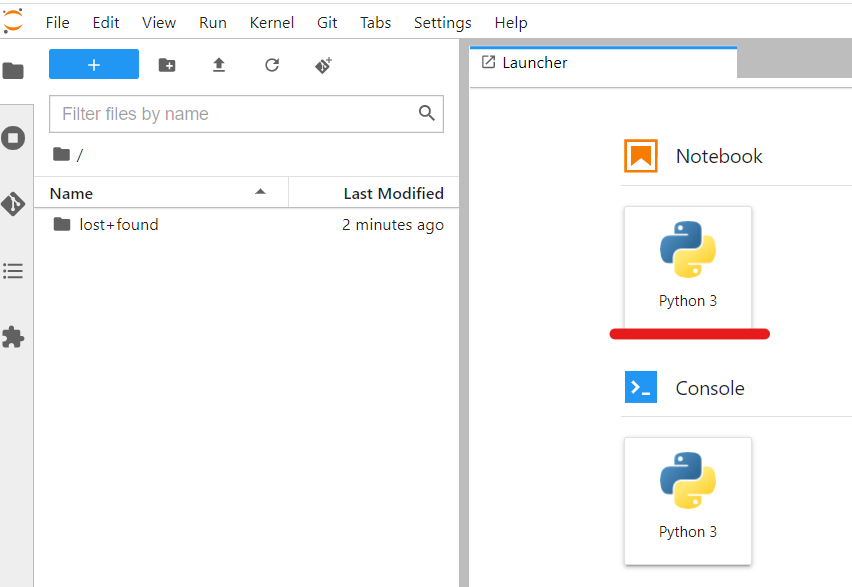

        <!-- !git clone https://github.com/kubeflow/examples.git git_kubeflow-examples -->
        !git clone https://github.com/julioo/examples.git git_kubeflow-examples

  

  Browse to /git_kubeflow-examples/mnist/ and launch mnist_vanilla_k8s.ipynb

  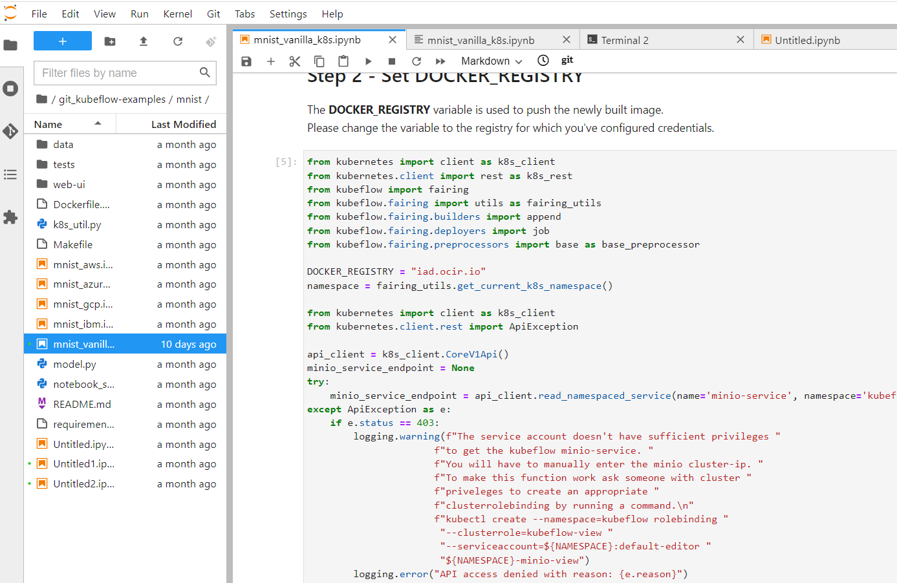

6. Edit Mnist examples variables

- DOCKER_REGISTRY

  Define DOCKER_REGISTRY to use your OCIR region (in this example Ashburn)

> DOCKER_REGISTRY = "iad.ocir.io"

  You can refer to [OCI documentation to find your Container Registry](https://docs.oracle.com/en-us/iaas/Content/Registry/Concepts/registryprerequisites.htm)
  
- s3_endpoint

 Define the OCI object storage endpoint

> s3_endpoint = "namespace.compat.objectstorage.us-ashburn-1.oraclecloud.com"

- mnist_bucket

> mnist_bucket = f"{DOCKER\_REGISTRY}-mnist"

- minio_endpoint

Change http to https

> minio_endpoint = "https://"+s3\_endpoint

- Create Customer Secret Keys

From OCI console user details, create customer secret keys.
  Click Generate Secret Key.
  Enter a friendly description for the key and click Generate Secret Key.
  The generated Secret Key is displayed in the Generate Secret Key dialog box. At the same time, Oracle generates the Access Key that is paired with the Secret Key. The newly generated Customer Secret key is added to the list of Customer Secret Keys.
<https://docs.public.oneportal.content.oci.oraclecloud.com/en-us/iaas/Content/Identity/Tasks/managingcredentials.htm#create-secret-key>

Replace with your values

> minio\_username = "12b...."
> minio\_key = "5+Pu....="

- Define Region

> minio\_region = "us-ashburn-1"

- Define Object storage bucket name created previously.

> mnist\_bucket = "mnist-oci"

- Define Kubeflow endpoint

Specify Kubeflow endpoint defined during the installation kf.a.b.c.d.nip.io

> EXTERNAL\_IP\_INGRESS = "kf.a.b.c.d.nip.io" or "host.domain.com"

#### Examples variables

    DOCKER_REGISTRY = "iad.ocir.io"
    s3_endpoint = "namespace.compat.objectstorage.us-ashburn-1.oraclecloud.com"
    mnist_bucket = f"{DOCKER_REGISTRY}-mnist"
    minio_endpoint = "https://"+s3_endpoint
    minio_username = "example"
    minio_key = "example"
    minio_region = "us-ashburn-1"
    EXTERNAL_IP_INGRESS=1.2.3.4 # your ingress ip address

6. Update cell 11 to update image_name variable

Update docker image to include OCIR repository namespace
Image must contains your namespace and OCIR repository.

   **image_name**="**namespace**/mnist"

    cluster_builder = cluster.cluster.ClusterBuilder(registry=DOCKER_REGISTRY,
    base_image="", # base_image is set in the Dockerfile
    preprocessor=preprocessor,
    image_name="namespace/mnist",
    dockerfile_path="Dockerfile",
    context_source=minio_context_source)
    cluster_builder.build()
    logging.info(f"Built image {cluster_builder.image_tag}")

7. Update Training Job specs

Include OCIR pull secrets

          serviceAccount: default-editor
          imagePullSecrets:
            - name: ocirsecret   

Set S3\_USE\_HTTPS to true

            - name: S3_USE_HTTPS
              value: "1"

Update model limits

        resources:
          limits:
            cpu: "1"
            memory: 1Gi
          requests:
            cpu: "1"
            memory: 1Gi    

8. Add to cell 44

> logging.info(f"Tensorboard URL: {EXTERNAL_IP_INGRESS}/mnist/{namespace}/tensorboard/")

9. Include cell 28 in Access the Web UI

> logging.info(f"APP UI URL: {EXTERNAL_IP_INGRESS}/mnist/{namespace}/ui/")

10. Execution

To execute Notebook select the cell and click on Run the cell or use Alt+Enter

Execute first

    import logging
    import os
    import uuid
    from importlib import reload
    import notebook_setup
    reload(notebook_setup)
    notebook_setup.notebook_setup()

then

    import k8s_util
    # Force a reload of kubeflow; since kubeflow is a multi namespace module
    # it looks like doing this in notebook_setup may not be sufficient
    import kubeflow
    reload(kubeflow)
    from kubernetes import client as k8s_client
    from kubernetes import config as k8s_config
    k8s_config.load_incluster_config()
    from kubeflow.tfjob.api import tf_job_client as tf_job_client_module
    from IPython.core.display import display, HTML
    import yaml

Finaly execute the first

if needed install and restart the kernel

    !pip install msrestazure
    !pip install nbconvert==6.4.3

Show UI URL

    logging.info(f"APP UI URL: {EXTERNAL_IP_INGRESS}/mnist/{namespace}/ui/")

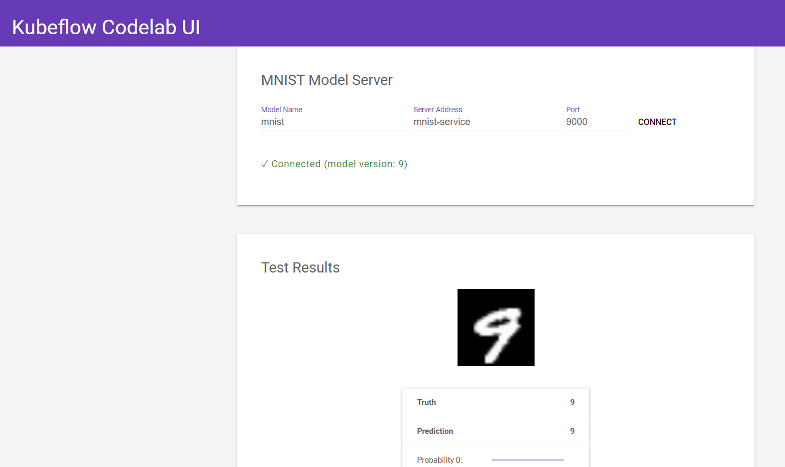
