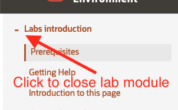

# Using the Kubeflow in the Oracle Kubernetes Environment

**Lab conventions**

We have used a few layout tricks to make the reading of this tutorial more intuitive : 

- If you see a "Bullet" sign, usually associated with numbered steps this means **you** need to perform some sort of **action**.  This can be 
  - Opening a window and navigating to some point in a file system
  - Executing some command on the command line of a terminal window :
    - For example : `ls -al`

As we cover quite some theoretical concepts, we included pretty verbose explanations.  To make the lab easier to grasp, we placed the longer parts in *Collapsibles*:

<b>Click this title to expand!</b>

If you feel you are already pretty familiar with a specific concept, you can just skip it, or read quickly through the text, then re-collapse the text section by re-clicking on the title.

---

## Prerequisites

These labs can be run in many different ways, but in all cases you will need access to a Oracle Cloud Tenancy and be signed in to it.

Please look at the instructions in the **Oracle Cloud Free Tier** section for details of how to sign up for a free trial tenancy and how to log into it. If you already have access to a tenancy (you may be in an instructor led lab, or have a pre-existing tenancy) then go direct to Prerequisites Step 2 which covers how to login to the tenancy.

## Lab navigation

You can navigate to the modules themselves by using the navigation list on the left. Some modules have a lot of sections, so to make navigation easier you can expand a module by clicking the '+' next to the module name in the modules list, you can shrink a module in the list by clicking the '-' by it's name. 

 

You can go directly to a module or section within a module by clicking on the name in the navigation list

## Getting Help

If you are in an instructor led lab then clearly just ask your instructor, if you are working through this self guided then each module has a section at the end for getting help.

## What's in this document ?

This document is a summary of the various modules in the lab. This document itself does not contain the lab instructions

### Getting Started

This explains how to get access to a Free trial tenancy if you need one. In many lab situations you will have already done this.

### Setup using the all-in-one script

This module shows you how to use the "all-in-one" scripts to setup the environment for your lab in one go. If you are running in a free trial, or have full admin rights to your tenancy **and** are running in your home region this is the preferred approach, just follow the instructions in this module then once completed jump directly to module **Part 1** skipping the remaining setup modules.

If however you are not in a free trial, do not have full admin rights, not in your home region, or need to modify the default choices for some reason then please use the remaining setup modules instead.

<!-- ## Kubeflow setup - introduction -->

## Run Kubeflow pipelines on OKE - introduction

Kubeflow is a collection of cloud native tools for all of the stages of MDLC (data exploration, feature preparation, model training/tuning, model serving, model testing, and model versioning).

Kubeflow provides a unified system—leveraging Kubernetes for containerization and scalability, for the portability and repeatability of its pipelines.

<!-- (source https://learning.oreilly.com/library/view/kubeflow-for-machine/9781492050117/ch01.html#idm45831188258120) -->

### Introduction

This lab covers the steps to install Kubeflow and run your first pipelines.

You will learn:

- Deploy Kubeflow with OKE
- Run your first Pipelines
  - Kubeflow Demo XGBoost - Iterative model training
  - Run a piple with node pool selector (CPU or GPU)
  - Run MNIST E2E Demo on Kubeflow
- Optional tasks
  - Enable OKE autoscaling
  - Enable NFS class storage

### Prerequisites

Use Cloud Shell console
oci-cli, kubectl, git are integrated

### Warning

- **Kubeflow 1.6.0 is not compatible with version Kubernetes 1.22 and backwards.**
<!-- - You can track the remaining work for K8s 1.22 support in kubeflow/kubeflow#6353
https://github.com/kubeflow/kubeflow/issues/6353 
-->

- Kustomize (version 3.2.0) ([download link](https://github.com/kubernetes-sigs/kustomize/releases/tag/v3.2.0))
  - Kubeflow 1.6.0 is not compatible with the latest versions of Kustomize.

### Steps

[Task 1 - Create an OKE cluster](./Lab-Kubeflow-step1.md)

[Task 2 - Install Kubeflow](./Lab-Kubeflow-step3.md)

[Task 3 - Run Kubeflow examples](./Lab-Kubeflow-step4.md)

[Task Optional](./Lab-Kubeflow-step4.md)

Please read **Kubeflow setup - introductions** section. When you've completed it click the `back` button on your browser to return to this page.

## Resetting your tenancy

Should you wish (or need) to do so this module shows you how to use a script to remove the resources you created in this lab

## At the end of the tutorial

We hope you enjoy doing the labs, and that they will be useful to you.

When you finish the modules in this lab the take the time for a cup of tea (or other beverage of your choice). While you're having that well earned break we recommend that you visit the [Oracle live labs site](https://apexapps.oracle.com/pls/apex/dbpm/r/livelabs/home) for a wide range of other labs on a variety of subjects.

## Acknowledgements

- **Author** - Julien Silverston, Cloud Native Solutions Architect, OCI Strategic Engagements Team, Developer Lighthouse program
- **Last Updated By** - Julien Silverston, August 2022
