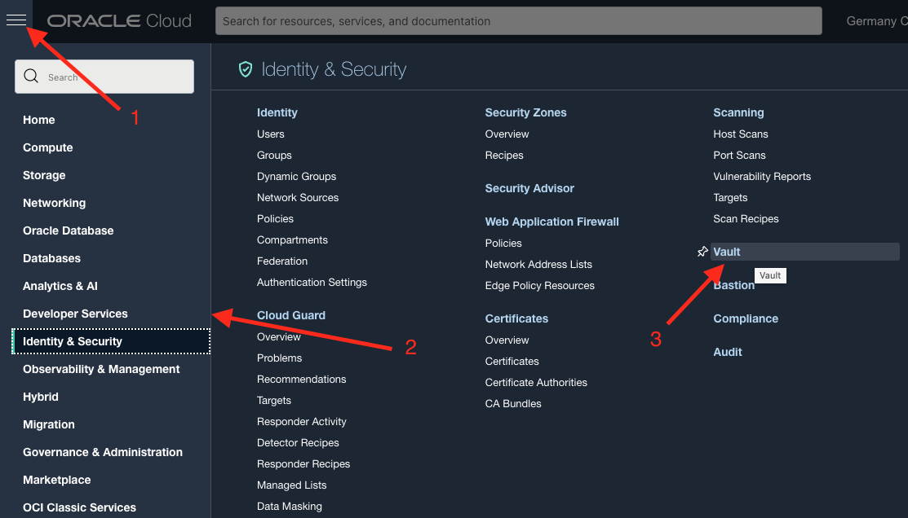
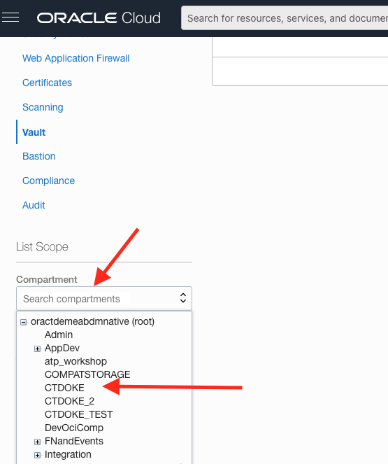
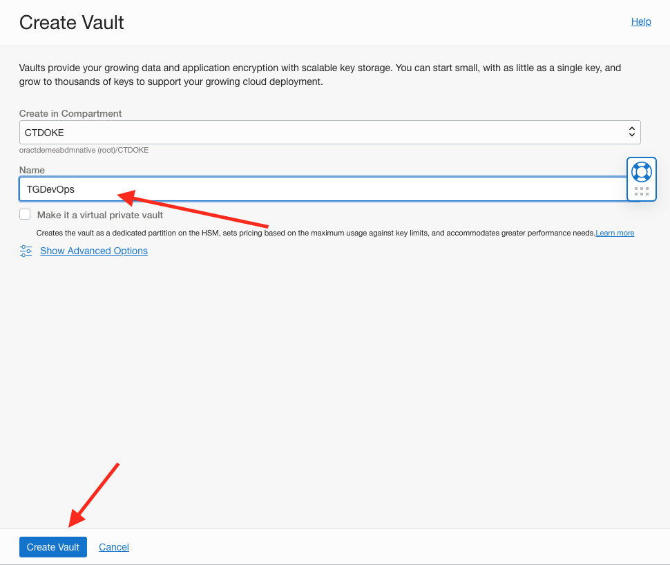
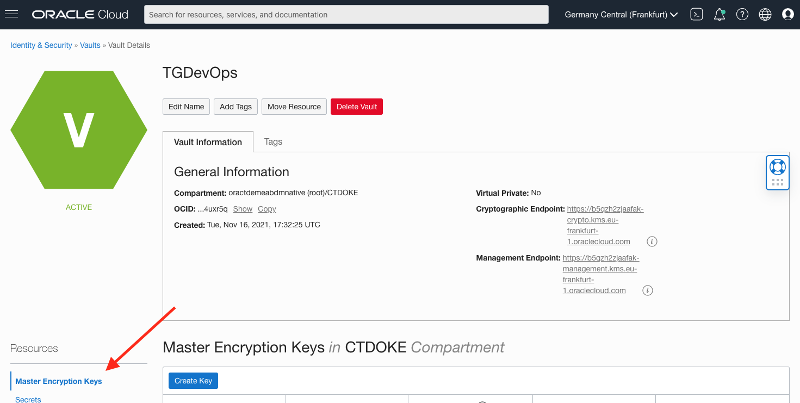
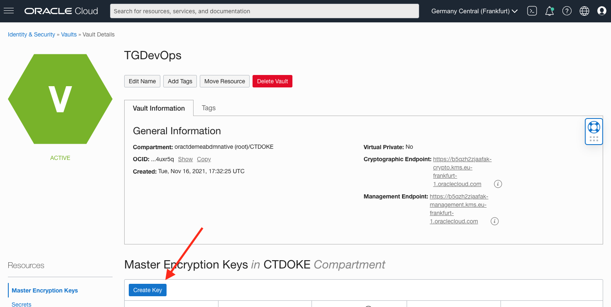
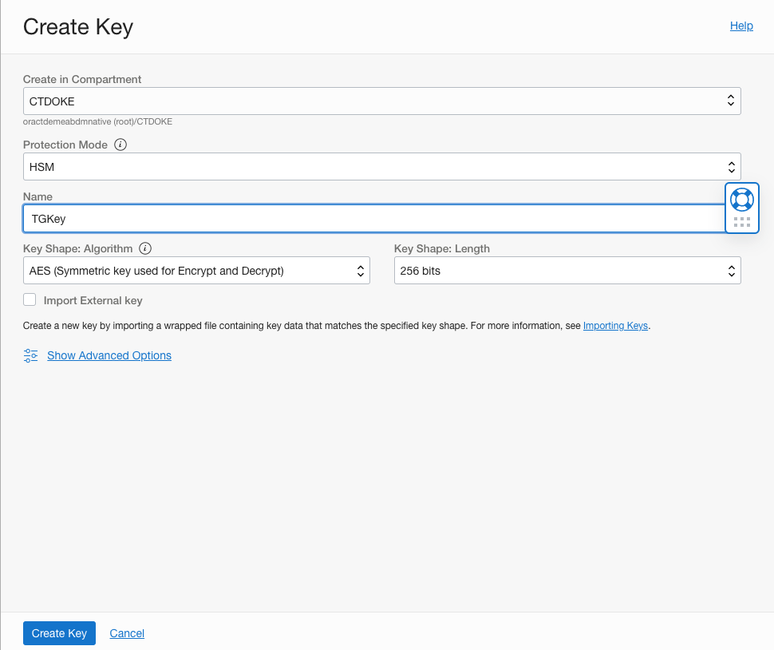

# OCI Vault Creation

## Introduction

One of the ways you can pass information into a OCI DevOps build pipeline is to store it in a secret in an OCI vault. To do this of course we need to create a vault, and a master key to encrypt secrets held within the vault.

### Objectives

Using the OCI Cloud shell and Browser User Interface we will :

  - Create a OCI Vault
  
  - Create a master key for the vault

## Task1: Creating a Vault in OCI

We need to go to the Vault service page

  1. In the Hamburger menu go to **Identity & Security** then **Vault**
  
  

  2. Use the Compartment selector on the left side to be sure to use the compartment you're running this lab in. If you're doing this in a free trial account that will probably be CTDOKE, in a shared or paid tenancy it will may be different. To chose a compartment click in the compartments block on the left of the page, then chose your compartment from the dropdown. In the image below we have many compartments, but in a free trial you will probably only have the CTDOKE compartment.
  
    
  

  3. Once you have the right compartment selected you will see a list of vaults in it. The tenancy I used to do the screen grabs is used for many things so there are multiple vaults already listed, but in a free trial there probably won't be any in the list. Click the **Create Vault** button to start the wizard
  
  

  4. Double check the right compartment is selected and name the vault, I'd suggest something like `<YOUR INITIALS>DevOps` Ensure that the **Make it a private vault** option is not selected, click the **Create Vault** button.
  
  

You will see the vault is in the **Creating** stage and it has an orange dot.

  

The creation process can take a couple of minutes, when it completes the status will become **Active** and the vault will have a green dot.

  
  
Now the vault is active you can create a master key for it.

## Task2: Creating the vault master key

Next you need to create a master key to protect the data in the vault

  1. Click the vault name to open it's page
  
  
  
  2. Make sure you are on the **Master encryption Keys** in the **Resources** section on the left side 
  
  
  
  3. Click the **Create Key** button to wtart thew wizard
  
  

  4. Confirm that the compartment is the one you're using for this lab, Ensure that the **Protection mode** is set to `HSM` Name the key - I'd suggest something like `<YOUR INITIALS>Key` but as long as you remember it the name doesn't matter. Check the **Key Shape** is set to `AES (Symmetric key used for Encrypt and Decrypt)` and the **Key Shape Length** is set to `256 bits`.
  
  

  5. Click the **Create Key** button
  
  
  
  The creation process will start, the new key will be in the `Creating` state with an orange dot
  
  
  
  Once created the dot will change to green and the state will become `Enabled`
  
  
  
## End of the Module, what's next ?

Congratulations, you're now ready to use your vault to hold secret configuration information, The next step is to configure your environment for ssh access.

## Acknowledgements

* **Author** - Tim Graves, Cloud Native Solutions Architect, EMEA OCI Centre of Excellence
* **Last Updated By** - Tim Graves, November 2021
  